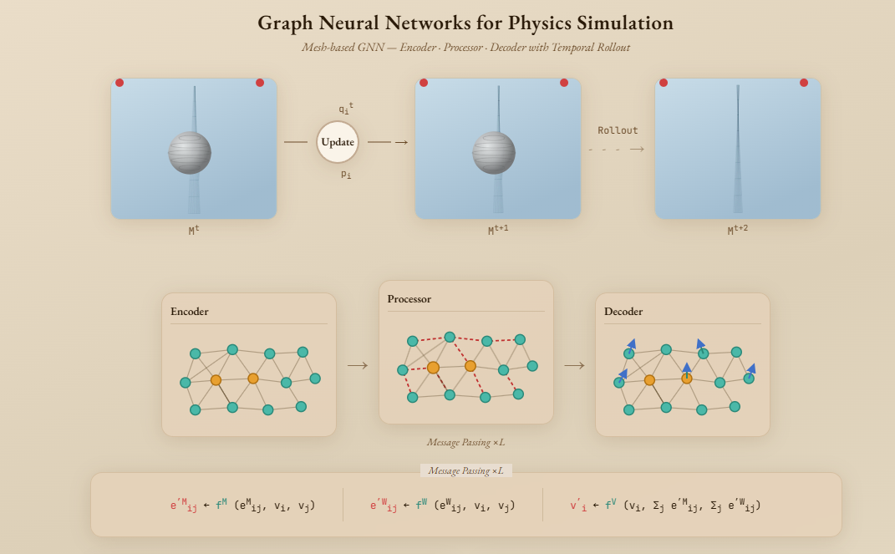

# 🧠 GNN Physics Simulation — Interactive Diagram

An animated, interactive HTML visualization of **Graph Neural Networks (GNNs) for mesh-based physics simulation**, faithfully recreating the architecture diagram from the paper by Kavishka Abeywardana.

---

## 📁 Files

| File | Description |
|------|-------------|
| `gnn_diagram.html` | Full interactive diagram — visual recreation of the paper figure |
| `gnn_physics.html` | Educational explainer page — warm glassmorphism UI with concepts & equations |

---

## 🖼️ What's Inside

### `gnn_diagram.html`
A pixel-faithful animated recreation of the original research diagram, built entirely with HTML, CSS, SVG, and Canvas — **no libraries, no dependencies**.

**Sections rendered:**

#### 1. Temporal Rollout (Top Row)
- Three animated **cloth mesh simulations** rendered in SVG: `M^t`, `M^t+1`, `M^t+2`
- Deforming fabric with a sphere (ball) pushing through the mesh
- **Update circle** with `q_i^t` and `p_i` labels
- **Dashed rollout arrow** between `M^(t+1)` → `M^(t+2)`

#### 2. GNN Architecture Block
- **Encoder** — SVG graph with teal & amber nodes, mesh edges
- **Processor** — Active message-passing with animated dashed red edges and pulsing central nodes
- **Decoder** — Node graph with velocity arrows drawn on output nodes
- Labels: *Message Passing ×L*

#### 3. Message Passing Equations
Three update rules displayed in a styled equation panel:
```
e′ᴹᵢⱼ ← fᴹ(eᴹᵢⱼ, vᵢ, vⱼ)
e′ᵂᵢⱼ ← fᵂ(eᵂᵢⱼ, vᵢ, vⱼ)
v′ᵢ   ← fᵛ(vᵢ, Σⱼ e′ᴹᵢⱼ, Σⱼ e′ᵂᵢⱼ)
```

#### 4. Dual Space Panels (Bottom Row)
| Panel | Description |
|-------|-------------|
| **World Space x** | Animated deforming cloth mesh, 3D sphere with grid lines, red xᵢ/xⱼ nodes with arrow, xᵢⱼ midpoint label, radius annotation box `\|xᵢ − xⱼ\| < r_W` |
| **Mesh Space u** | Flat regular triangulated UV grid, static red uᵢ/uⱼ nodes with connecting edge and labels |

---

### `gnn_physics.html`
A polished **educational explainer** with warm glassmorphism aesthetic:
- Hero section with concept overview
- Encoder → Processor → Decoder pipeline strip
- Interactive message passing equations
- Dual space tags (World Space vs Mesh Space)
- Clickable temporal rollout timeline
- Application domain cards (weather, graphics, aerospace, etc.)
- Feature capability cards

---
## 🔗 Live Demos

| Demo | Description |
|------|-------------|
| [Live Demo](https://khmer-ocr-case-study-unicode-list.netlify.app/) | Khmer Unicode List U1780  | 

## 🚀 Usage

Open either file directly in any modern browser — no server, build step, or dependencies required.

```bash
# Simply open in browser
open gnn_diagram.html
open gnn_physics.html
```

Or serve locally:
```bash
python3 -m http.server 8080
# Then visit http://localhost:8080/gnn_diagram.html
```

---

## 🛠️ Technical Stack

| Layer | Technology |
|-------|-----------|
| Layout | HTML5 + CSS3 Flexbox |
| Styling | CSS custom properties, glassmorphism, backdrop-filter |
| Mesh animation | SVG (cloth panels) + Canvas 2D API (world/mesh space) |
| Graph nodes | Inline SVG with dynamically created elements |
| Fonts | EB Garamond (serif display), JetBrains Mono (equations) |
| Animation | CSS keyframes + `requestAnimationFrame` loop |

---

## 🎨 Design Notes

- **Color palette:** Warm cream `#e8ddd0`, teal `#4ab8a8`, amber `#e8a030`, red `#d04040`, blue `#4070c8`
- **Canvas fix:** Both canvases initialize inside `window.addEventListener('load', ...)` using `getBoundingClientRect()` to ensure correct DPI-aware sizing after DOM layout completes
- **Device pixel ratio:** All canvas drawings scale with `window.devicePixelRatio` for crisp rendering on retina/HiDPI displays

---

## 📐 Architecture Concepts Visualized

```
Physical Mesh (M^t)
        ↓
   [ Encoder ]  →  latent node & edge embeddings
        ↓
   [ Processor ] →  L rounds of message passing
        |              (mesh graph + world graph)
        ↓
   [ Decoder ]  →  per-node accelerations (dv/dt)
        ↓
   Numerical Integration  →  M^(t+1)
        ↓
   Rollout  →  M^(t+2), M^(t+3), ...
```

### Two Graph Representations
- **Mesh Graph** — fixed topology from the simulation mesh (structural edges)
- **World Graph** — dynamic proximity-based edges where `|xᵢ − xⱼ| < r_W`

---

## 📚 Reference

Based on the mesh-based GNN simulation architecture diagram by **Kavishka Abeywardana**, illustrating the approach from:

> *Learning to Simulate Complex Physics with Graph Networks*  
> Pfaff et al., DeepMind — ICML 2021

---

## 📄 License

This visualization is for **educational purposes**. The original diagram and research concept belong to their respective authors.
